# Awesome-Database-Migration-Service-DMS

# Awesome-Database-Migration-Service-DMS 🔄 🗄️



  





  
  
  
  
  
  



---

## 🌟 Top Database Migration Service (DMS) Ecosystem

**Curated List of Commercial DMS Platforms & Open-Source Data Replication Tools**  
*Focused on Homogeneous and Heterogeneous Migration, Change Data Capture (CDC), Schema Conversion, Continuous Replication & Self-Hosted Migration Pipelines*

**Last updated: October 2026** 📅

---

### 📌 Overview & SEO Summary
Welcome to the ultimate curated directory of **database migration service platforms**, **open-source data replication tools**, and **change data capture (CDC) frameworks**. Whether you are looking for enterprise-grade commercial solutions (such as *AWS DMS*, *Fivetran*, and *Qlik Replicate*), or self-hostable open-source alternatives (like *Debezium*, *Airbyte*, and *pgloader*), this list covers category leaders, continuous replication, and privacy-respecting data movement.

**Key Market Context:**
- **AWS DMS** supports **20+ source and target engines** with **ongoing replication and CDC**, while **Google Cloud DMS** focuses on **serverless, managed migrations** for MySQL, PostgreSQL, and SQL Server.
- **Debezium** is the **leading open-source CDC platform**, with **10K+ GitHub stars** and **Kafka Connect-based connectors** for PostgreSQL, MySQL, MongoDB, Oracle, and SQL Server .
- **Airbyte** has **18K+ GitHub stars** and **300+ connectors**, making it the **most comprehensive open-source ELT platform** .

---

## 📑 Table of Contents
- [🏢 SaaS & Commercial Platforms](#-saas--commercial-platforms)
- [🔓 Open-Source GitHub Projects](#-open-source-github-projects)
- [🛠️ How to Contribute](#%EF%B8%8F-how-to-contribute)
- [📊 Star History](#-star-history)
- [🤝 Support & Sponsorship](#-support--sponsorship)
- [⚠️ Disclaimer](#%EF%B8%8F-disclaimer)

---

## 🏢 SaaS / Commercial Platforms

The database migration market spans **hyperscaler DMS services** (AWS DMS, Google Cloud DMS, Azure DMS) that provide **fully managed migration with minimal downtime**, **data integration platforms** (Fivetran, Hevo, Airbyte Cloud) that focus on **ELT with hundreds of connectors**, and **enterprise replication platforms** (Striim, Qlik Replicate, Informatica) that offer **real-time CDC and heterogeneous migration at scale**. **AWS DMS** charges **$0.10/hour for a dms.t3.medium replication instance** plus **$0.02/GB for data transfer** . **Google Cloud DMS** uses **consumption-based pricing** . **Fivetran** charges **based on monthly active rows (MAR)** . **Striim** uses **custom enterprise pricing** .

| SaaS / Commercial Platform | Company / Owner | Valuation / Market Cap | Standard Edition Starting Price | Free Tier / Free Trial Limits | Description |
| :--- | :--- | :--- | :--- | :--- | :--- |
| **[AWS Database Migration Service (DMS)](https://aws.amazon.com/dms/)** ☁️ | Amazon | ~$2.0 Trillion | **$0.10/hour** (dms.t3.medium) + **$0.02/GB** data transfer  | **Free tier: 750 hours of dms.t3.micro for 12 months**  | **AWS-native migration service** — **Supports 20+ source and target engines** including Oracle, SQL Server, MySQL, PostgreSQL, MongoDB, and S3 . **Homogeneous and heterogeneous migration** with **Schema Conversion Tool (SCT)** for DDL conversion . **Ongoing replication with CDC** for minimal downtime . **Serverless option** for automatic scaling . |
| **[Google Cloud Database Migration Service](https://cloud.google.com/database-migration)** 🌐 | Google (Alphabet) | ~$2.0 Trillion | **Consumption-based** (serverless) | **$300 free credits** for new customers | **GCP-native migration service** — **Serverless, managed migrations** for MySQL, PostgreSQL, and SQL Server . **Minimal downtime** with **continuous replication** . **Integrated with Cloud SQL and AlloyDB** . |
| **[Azure Database Migration Service](https://azure.microsoft.com/en-us/products/database-migration/)** 🔷 | Microsoft | ~$3.90 Trillion | **Consumption-based** (DMS instance hours) | **Free tier: limited** | **Azure-native migration service** — **Migrates to Azure SQL Database, SQL Managed Instance, and PostgreSQL** . **Assessment and SKU recommendations** . **Online and offline migration modes** . |
| **[Fivetran](https://www.fivetran.com/)** 🚀 | Fivetran | ~$5.6 Billion | **Usage-based** (monthly active rows) | **Free tier: 500,000 MAR/month** | **Automated data integration** — **500+ connectors** for databases, SaaS, and APIs . **Automated schema migration and transformation** . **Rated Innovative in 2026 ISG Buyers Guide** . **The most automated ELT platform** . |
| **[Striim](https://www.striim.com/)** ⚡ | Striim | Private | **Custom enterprise pricing** | **Free trial available** | **Real-time data integration and streaming** — **Continuous CDC from Oracle, SQL Server, MySQL, and PostgreSQL** . **Zero-downtime migration** to cloud databases . **In-flight transformation and validation** . |
| **[Qlik Replicate](https://www.qlik.com/)** 🟢 | Qlik | ~$3 Billion | **Custom enterprise pricing** | **Free trial available** | **Data replication and CDC** — **Real-time replication across heterogeneous databases** . **Zero-downtime migration** . **Automated schema conversion** . |
| **[Hevo Data](https://hevodata.com/)** 📊 | Hevo | Private | **Usage-based** (events per month) | **Free tier: 1 million events/month** | **No-code data pipeline platform** — **150+ connectors** for databases, SaaS, and analytics . **Automated schema mapping and transformation** . **Bi-directional sync** . |
| **[Informatica Cloud Data Integration](https://www.informatica.com/)** 🏢 | Informatica | ~$8 Billion | **Custom enterprise pricing** | **Free trial available** | **Enterprise data integration** — **Cloud-native ETL/ELT** with **AI-powered recommendations** . **Massive connector library** . **The most comprehensive enterprise data integration platform** . |
| **[Arcion](https://www.arcion.io/)** 🎯 | Arcion (Databricks) | Private | **Custom pricing** | **Free trial available** | **Zero-code CDC platform** — **Real-time replication from Oracle, MySQL, and SQL Server** to cloud warehouses . **Acquired by Databricks** in 2023. **Built for high-volume, low-latency replication** . |
| **[Airbyte Cloud](https://airbyte.com/)** ☁️ | Airbyte | Private | **Usage-based** (credits) | **Free tier: 14-day trial** | **Open-source ELT platform** — **300+ connectors** . **Self-hosted or cloud** . **The most flexible open-source data integration platform** . |

---

## 🔓 Open-Source GitHub Projects

*Sorted by GitHub_Stars_Count (Descending)* 🌟

- **[Debezium](https://github.com/debezium/debezium)**   
  **The leading open-source change data capture (CDC) platform**, Apache-2.0 licensed. **10K+ GitHub stars** — **the de facto standard for CDC** . **Kafka Connect-based connectors** for **PostgreSQL, MySQL, MongoDB, Oracle, SQL Server, Db2, and Cassandra** . **Captures row-level changes in real-time** and streams them to Kafka . **Used by thousands of organizations** for **database migration, microservices integration, and real-time analytics** . **The foundation of modern data replication architectures** . 🔄

- **[Airbyte](https://github.com/airbytehq/airbyte)**   
  **The leading open-source ELT platform**, MIT licensed (core); **Airbyte Cloud** is commercial. **18K+ GitHub stars** — **300+ connectors** for databases, APIs, and SaaS . **Self-hosted or cloud** . **Connector Development Kit (CDK)** for custom connectors . **The most comprehensive open-source data integration platform** . **Used by thousands of organizations** for **data replication and migration** . ☁️

- **[pgloader](https://github.com/dimitri/pgloader)**   
  **Migrate to PostgreSQL in a single command**, PostgreSQL License. **5K+ GitHub stars** — **the simplest PostgreSQL migration tool** . **Migrates from MySQL, SQLite, MS SQL, and CSV** to PostgreSQL . **Automatic schema conversion and data type mapping** . **Continuous migration mode** for minimal downtime . **The most accessible open-source database migration tool** . 🐘

- **[pg_dump / pg_restore](https://github.com/postgres/postgres)**   
  **PostgreSQL's native backup and restore tools**, PostgreSQL License. **The standard for PostgreSQL migration** — **logical backup and restore** . **Custom, directory, and tar formats** . **Parallel restore** for faster migrations . **The foundation of every PostgreSQL migration workflow** . 🛠️

- **[MySQL Shell](https://github.com/mysql/mysql-shell)**   
  **Advanced MySQL client with migration utilities**, GPL-2.0 licensed. **`util.dumpInstance()` and `util.loadDump()`** for **parallel, multi-threaded migration** . **Compatible with MySQL, Percona, and MariaDB** . **The official MySQL migration tool** . 🐬

- **[Barman](https://github.com/EnterpriseDB/barman)**   
  **Backup and recovery manager for PostgreSQL**, GPL-3.0 licensed. **2K+ GitHub stars** — **the most robust PostgreSQL backup tool** . **Point-in-time recovery (PITR)** . **Remote backup and recovery** . **The standard for PostgreSQL disaster recovery and migration** . 💾

- **[pgBackRest](https://github.com/pgbackrest/pgbackrest)**   
  **Reliable PostgreSQL backup and restore**, MIT licensed. **Parallel backup and restore** — **the fastest PostgreSQL backup tool** . **Delta restore and incremental backup** . **S3, GCS, Azure, and SFTP support** . **The standard for PostgreSQL migration and disaster recovery** . ⚡

- **[Mydumper / Myloader](https://github.com/mydumper/mydumper)**   
  **Parallel MySQL dump and restore**, GPL-3.0 licensed. **3K+ GitHub stars** — **multi-threaded backup and restore** for MySQL and MariaDB . **Consistent snapshots** with **less locking** . **The standard for parallel MySQL migration** . 🚀

- **[Kafka Connect](https://github.com/apache/kafka)**   
  **Framework for connecting Kafka with external systems**, Apache-2.0 licensed. **The foundation for Debezium CDC** . **Source and sink connectors** for databases, file systems, and cloud services . **The most widely deployed open-source data pipeline framework** . 🌊

- **[CloudNativePG](https://github.com/cloudnative-pg/cloudnative-pg)**   
  **PostgreSQL operator for Kubernetes**, Apache-2.0 licensed. **Declarative backup and recovery** with **PITR** . **Primary/standby architecture** with **automated failover** . **The standard for PostgreSQL migration to Kubernetes** . ☸️

- **[pglogical](https://github.com/2ndQuadrant/pglogical)**   
  **Logical replication extension for PostgreSQL**, PostgreSQL License. **Streaming replication** with **row-level filtering** . **Bi-directional replication** . **The most flexible PostgreSQL replication tool** . 🔗

- **[Oracle GoldenGate (Open-Source Alternatives)](https://github.com/...)**   
  **Open-source alternatives to Oracle GoldenGate** — **Debezium for CDC, Striim for enterprise CDC, and Qlik Replicate for heterogeneous replication** . **The complete open-source stack for Oracle database migration** . 🏛️

---

## 🛠️ How to Contribute

Contributions are welcome! Follow these steps to submit new database migration platforms or open-source replication software:

1. 🍴 **Fork** the repository.
2. 📝 **Add/edit** entries in `README.md` maintaining table/list structure and formatting.
3. 🔗 Include project title, official website/GitHub link, exact Stars_Count, license, and brief description.
4. 🚀 Submit a **Pull Request** with a descriptive summary of your changes.

---

## 📊 Star History



---

## 🤝 Support & Sponsorship

If you find this database migration repository useful, please consider supporting the project:

- ⭐ **Star** this repository to increase visibility!
- 🔀 **Fork** and share with fellow database engineers, data platform teams, and open-source advocates.
- ☕ **Sponsor & Buy Me a Coffee**: Support ongoing open-source curation via the [GitHub Sponsor Dashboard](https://github.com/sponsors/ishandutta2007).

---

## ⚠️ Disclaimer

- This is a **community-curated** list — not exhaustive and not an endorsement. ℹ️
- **AWS DMS supports 20+ source and target engines** with **homogeneous and heterogeneous migration**, while **Google Cloud DMS focuses on serverless migrations** for MySQL, PostgreSQL, and SQL Server . **Debezium is the leading open-source CDC platform** with **10K+ GitHub stars** .
- **Heterogeneous migrations require schema conversion** — **AWS SCT** for DDL conversion, **pgloader** for automatic schema conversion to PostgreSQL . **Always test schema conversion before data migration** .
- **Open-source migration tools are not turnkey** — **Debezium requires Kafka and Kafka Connect** . **Airbyte requires deployment and connector configuration** . **pgloader requires PostgreSQL and source database access** . **Always validate migration correctness and performance with a proof-of-concept** before production deployment . 🔄

---



  <b>Made with ❤️ for database engineers, data platform teams, and open-source migration advocates.</b>

